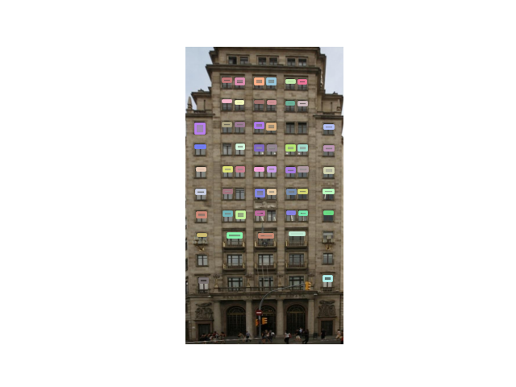

## Mask-to-coco-json
This repo aims to offer a concise and faste script to complete the conversion from BGR masks to coco format.

This repo is based on https://github.com/waspinator/pycococreator, and makes some improvements:
- Use faster operations to replace some time-consuming ones, deletes some unnecessary ones. 
- Numpy and Opencv are the two main libs, so you can easily understand the script logic.
- No need to generate a segmentation mask for each object in an image, compared with the above repo. Just use a bgr mask for an image, the script will automate to extract each object mask. So it can save many disk memory and generation time.
- Provide a visualization script (check_bbox.py) to check if correct coco format is converted.

## Usage
### Data structure
$/path/to/your/project/mask-to-coco-json/
````bash
├── examples
│   ├── images
│   │   ├── <image_name>.jpg
│   │   ├── ...
│   │ 
│   │── masks
│   │   ├── <image_name>.png
│   │   ├── ...
│   │   
│   │── single_masks
│   │   ├── <image_name>_<object_class_name>.png
│   │   ├── ...
````
Note: only need image and bgr mask pairs. You can choose to generate a segmentation mask for each category in an image under the folder of single_masks (use the arg of single_mask_flag in main.py).

In this repo, facade dataset is used as the examples. Dowload it by https://cmp.felk.cvut.cz/~tylecr1/facade/CMP_facade_DB_base.zip.

For example:
|  | | | |
|:---:|:---:|:---:|:---:|

### Run the script 
There are some args needed to be defined in the main.py:
- ROOT_DIR: /path/to/your/project/mask-to-coco-json/examples.
- IMAGE_DIR: images folder under ROOT_DIR.
- ANNOTATION_DIR: masks folder under ROOT_DIR.
- SINGLE_MASK_DIR: single_masks folder under ROOT_DIR.
- `CATEGORIES = [
    {
        'id': 0,
        'name': 'xx',
        'supercategory': 'xx',
        'color': [0, 255, 255]  # the color used to mask the object
    }
]`, where 'color' is a list for the category 'xx' to draw bgr mask. You can add other categories like this way.

Finally, run:
1. generate the single mask

`python main.py --single_mask_flag True`

2. not generate the single mask

`python main.py`

The following files will be generated:
- Coco format json: train.json
- Single mask for the category of 'xx': cmp_b0001_xx.png (optional)

### Check the result
Modify the path args and then run:

`python check_bbox.py`

bbox.png will be generated.
